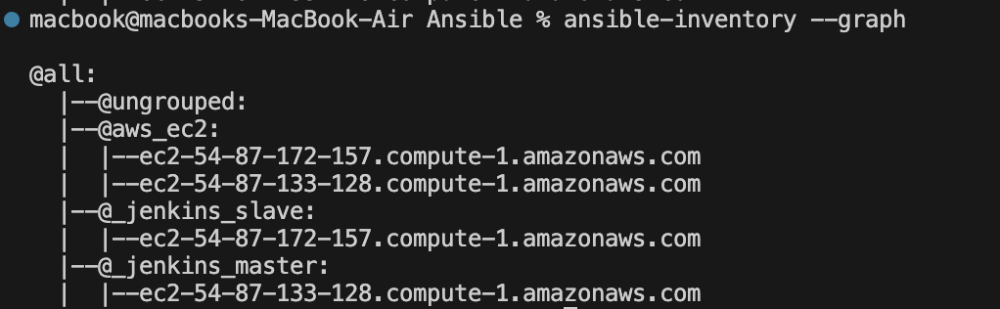
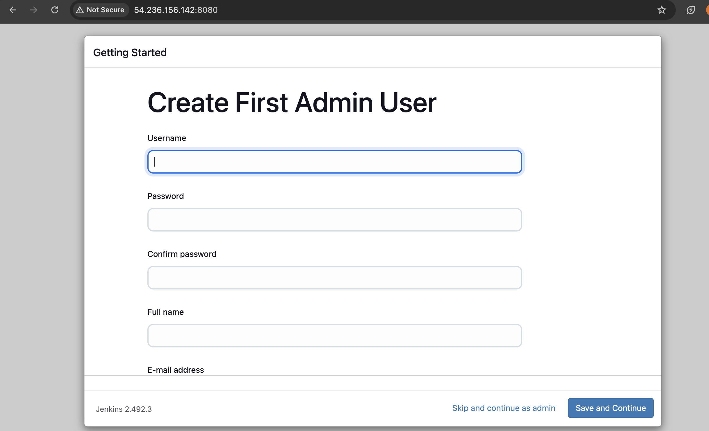
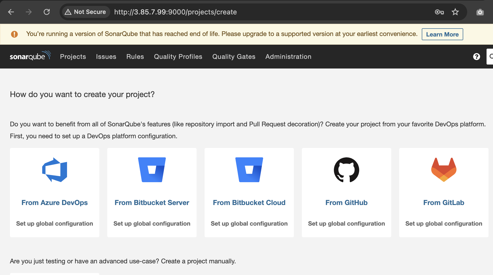
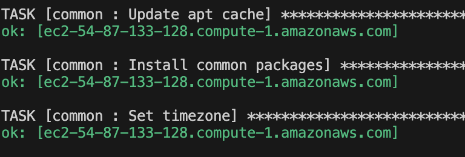
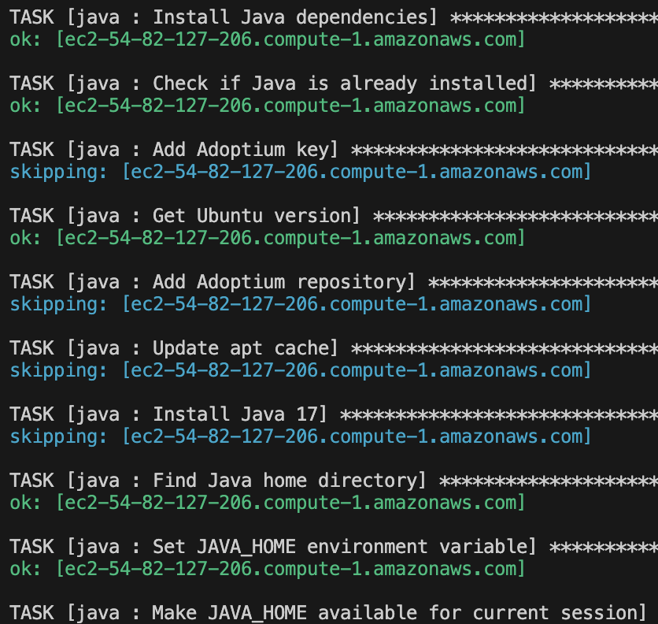
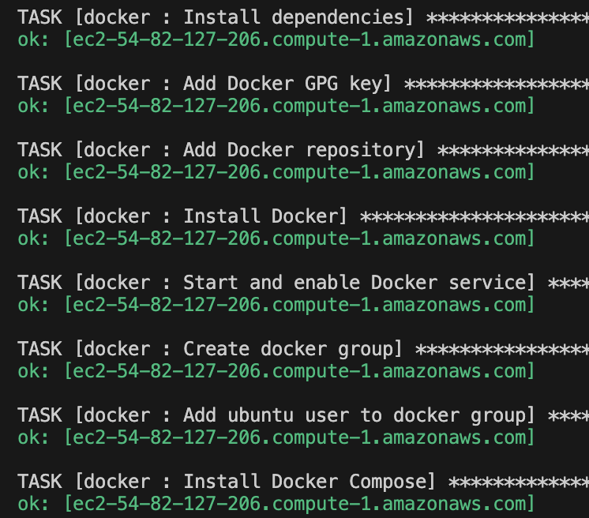
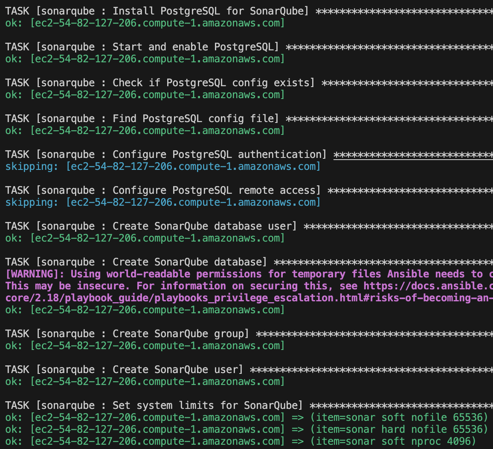

# Jenkins Infrastructure Configuration with Ansible

This repository provides a **complete Ansible-based solution** for **automated deployment** and **management** of a Jenkins CI/CD infrastructure on AWS EC2 instances.

It uses a **dynamic inventory** to discover and manage EC2 instances based on their **tags**, grouping them automatically for **targeted playbook execution**. It can **fallback to a static inventory** if dynamic discovery fails.

---

## 🚀 Features

- **Dynamic EC2 Inventory**: Automatically discovers instances based on AWS tags.
- **Role-Based Configuration**: Modular and organized Ansible roles for components.
- **Modular Playbooks**: Main and task-specific playbooks for flexibility.
- **Environment Configuration**: Ensures environment readiness (system limits, permissions, etc.).
- **Service Management**: Configures systemd services and dependencies.
- **Complete CI/CD Setup**: Jenkins (with agents) + SonarQube (with PostgreSQL) on AWS.
- **Dockerized Environment**: Docker installed and configured across all nodes.

---

## 📋 Prerequisites

- AWS CLI configured with valid credentials.
- Terraform-deployed AWS Infrastructure (see [`Terraform/`](./Terraform) directory).
- Python 3.x installed with pip.
- Ansible 2.9+ installed.
- EC2 Key Pair (`jenkins-key.pem`) available and permissions set.

Install required Python packages:

```bash
pip install ansible boto3 botocore
```

Set key pair permissions:

```bash
chmod 400 ~/jenkins-key.pem
```

---

## 📂 Directory Structure

```
├── ansible.cfg             # Ansible configuration file
├── inventory/              # Dynamic inventory configuration for AWS
│   └── ec2.py / ec2.yaml
├── playbooks/              # Playbooks for different node types
│   ├── site.yml            # Full infrastructure setup
│   ├── jenkins-master.yml          # Jenkins master setup
│   └── jenkins-slave.yml           # Jenkins slave setup
├── roles/                  # Ansible roles
│   ├── common/             # Common setup (packages, users, etc.)
│   ├── java/               # Java installation
│   ├── docker/             # Docker installation and configuration
│   ├── jenkins_master/     # Jenkins master setup
│   ├── jenkins_slave/      # Jenkins slave setup
│   └── sonarqube/          # SonarQube and PostgreSQL setup
```

---

## ⚙️ Usage

### 1. Verifying Dynamic Inventory

Check if instances are correctly grouped:

```bash
ansible-inventory --graph
```


---

### 2. Running Playbooks

- Configure **all instances**:

```bash
ansible-playbook playbooks/site.yml
```

---

## 🌐 Accessing Services

After playbook execution:

- **Jenkins**:  
  http://<master_public_ip>:8080  
  Username: `admin`  
  Password: `admin123` (or as set in `group_vars`)



- **SonarQube**:  
  http://<master_public_ip>:9000  
  Default credentials: `admin/admin`



---

## 🔧 Components Installed

### Master Node

- Java 17
- Git, Docker, and essential packages
- Jenkins (with pre-installed plugins)
- SonarQube (with integrated PostgreSQL database)

### Slave Node

- Java 17
- Git, Docker, and essential packages
- Jenkins agent (configured to connect to the master automatically)

---

## 📑 Role-Based Configuration Overview

- **Common Role**:  
  Sets up basic system packages, users, and permissions.



- **Java Role**:  
  Installs and configures Java 17.



- **Docker Role**:  
  Installs Docker, adds necessary users to the Docker group.



- **Jenkins Master Role**:  
  Installs Jenkins, configures plugins, sets admin credentials.

- **Jenkins Slave Role**:  
  Installs and configures Jenkins agent.

- **SonarQube Role**:  
  Installs SonarQube, sets up PostgreSQL database, manages system limits.



---

## 🛠️ Service Management

- Creates **systemd service files** for Jenkins, SonarQube, PostgreSQL.
- Ensures services **start automatically on boot**.
- Handles service **dependencies** properly.

---

## 🏷️ EC2 Tag Requirements

Make sure your EC2 instances are tagged appropriately:

- Tag key: `Project`
- Tag value: `ivolve`

---

## 📈 Benefits

✅ Highly scalable and modular setup  
✅ Automated CI/CD foundation ready for production  
✅ Easy to extend and maintain  
✅ Docker-ready for microservice deployments  
✅ Code quality analysis out of the box with SonarQube  


