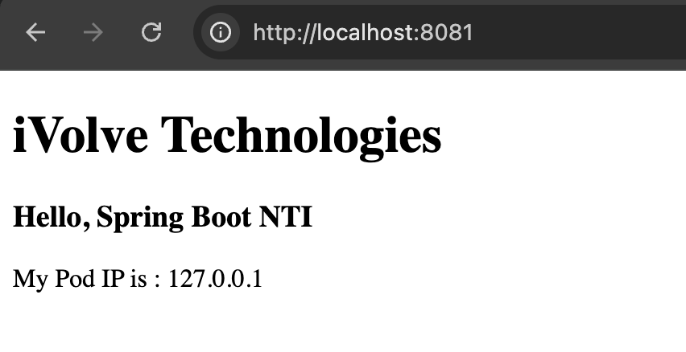
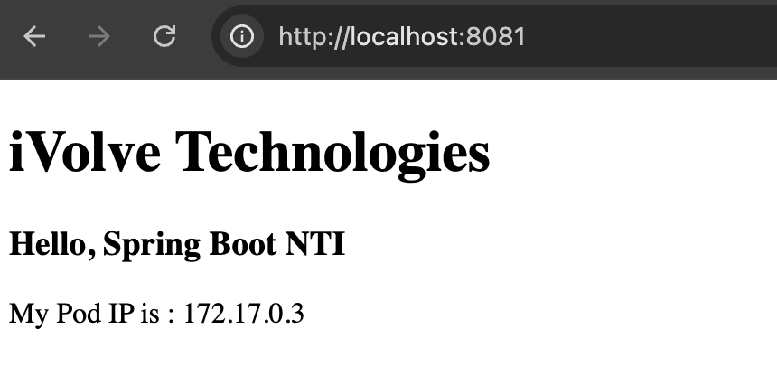

## Overview of the Project

This is a small Java web application built with Spring Boot framework. The application shows a simple webpage that displays "iVolve Technologies" and "Hello, Spring Boot NTI" along with the server's IP address. The project also includes a basic `MathService` class with unit tests.

## Key Technologies

1. **Java**: The programming language used for the application
2. **Spring Boot (v2.6.3)**: A framework that simplifies developing Java applications
3. **Gradle (v7.3.3)**: Build automation tool for compiling and packaging the application
4. **JUnit**: Testing framework for writing and running unit tests
5. **Thymeleaf**: Templating engine for rendering HTML views
6. **Docker**: Container platform (mentioned in README.md but not shown in the files)

## Project Structure

- `build.gradle`: Configuration file for the Gradle build tool
- `src/main/java`: Contains Java source code
  - `DemoApplication.java`: The main entry point for the Spring Boot application
  - `MathService.java`: A service with basic math operations
  - `controller/HomeController.java`: Web controller that handles HTTP requests
- `src/main/resources`: Contains application configuration and resources
  - `application.properties`: Application configuration (port settings, etc.)
  - `templates/index.html`: The HTML template for the home page
- `src/test`: Contains test code
  - `MathServiceTest.java`: Unit tests for the math service

## How the Application Works

1. When started, `DemoApplication.java` bootstraps the Spring application
2. The application serves web content on port 8081 (configured in `application.properties`)
3. When a user visits the root URL ("/"), `HomeController.java` handles the request
4. The controller gets the server's IP address and passes it to the view
5. The view (`index.html`) renders a simple page showing the IP address

## The Process 
### 1. Run Unit Tests

To verify the code works correctly, you need to run the unit tests:

```bash
# Navigate to the web-app directory
cd web-app

# Run tests using the Gradle wrapper
chmod +x gradlew
./gradlew test
```
### 2. Build JAR File

To compile and package your application into a JAR file:

```bash
# Build the project
./gradlew build
```

This will create a JAR file in the `build/libs` directory, named something like `demo-0.0.1-SNAPSHOT.jar`.

### 3. Run the App

To run the application locally:

```bash
# Run the JAR file
java -jar build/libs/demo-0.0.1-SNAPSHOT.jar
```

The application will start and be accessible at http://localhost:8081

### 4. Verify App is Working

Open your web browser and go to http://localhost:8081
You should see a page with "iVolve Technologies" and "Hello, Spring Boot NTI" and the IP address of your machine.



### 5. Create Docker File

Create a file named `Dockerfile` in the web-app 

### 6. Build Docker Image

```bash
# Build the Docker image
docker build -t ivolve-webapp .
```

This creates a Docker image named "ivolve-webapp".

### 7. Run Container

```bash
# Run the Docker container
docker run -p 8081:8081 ivolve-webapp
```

This runs the application in a Docker container and maps port 8081 from the container to port 8081 on your host machine.

### 8. Verify Container is Working

Open your web browser and go to http://localhost:8081 again.
You should see the same page as before, but now it's running inside a Docker container.

the IP address shown on the page - it different from your local machine's IP since it's the container's internal IP address.



