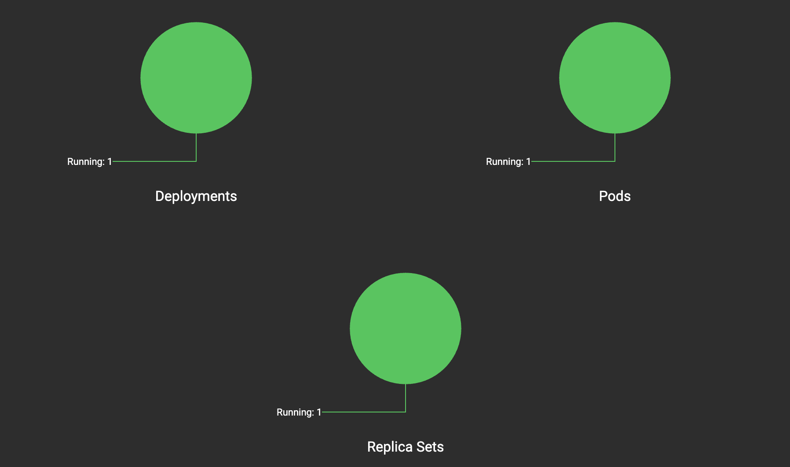
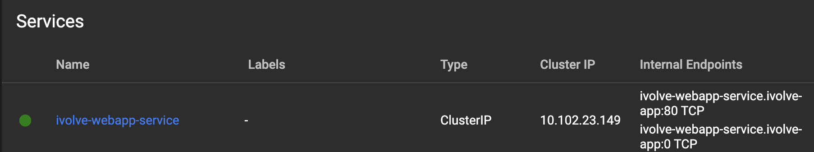
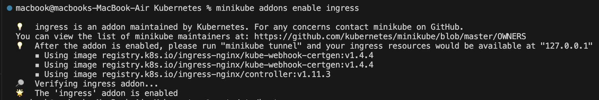
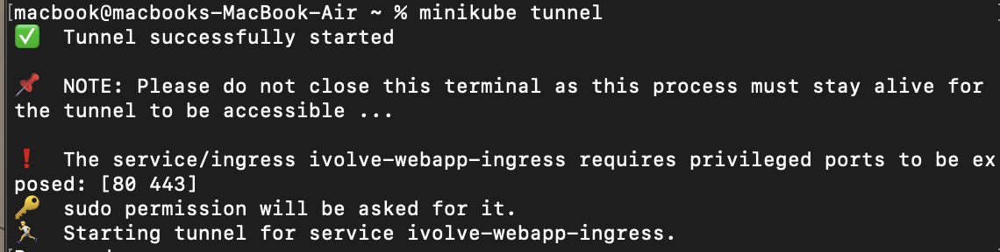
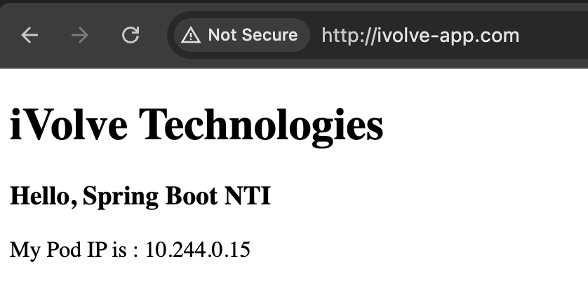

# Deploying a Spring Boot Application in Kubernetes

This guide explains the step-by-step process of deploying a Spring Boot application on Kubernetes. The document covers namespace creation, deployment, service, ingress setup, and persistent storage configuration.

## Prerequisites
- **Docker** installed and running.
- **Kubernetes cluster** (Minikube, Docker Desktop Kubernetes, or a cloud provider).
- **kubectl** configured to interact with the cluster.
- Access to a **container registry** (if pushing images for production use).

## Step 1: Create a Namespace
- Define a dedicated namespace to isolate resources for the application.
- This improves organization and management of Kubernetes objects.
```bash
kubectl create namespace ivolve-app
```
## Step 2: Deploy the Application
- Create a **Deployment** YAML file specifying:
  - The number of replicas.
  - Container image and resources.
  - Port configuration for the application.
- Apply the Deployment to the Kubernetes cluster.



## Step 3: Expose the Application with a Service
- Define a **Service** to expose the application within the cluster.
- Use a **ClusterIP** service type to allow internal communication.
- Map container ports to the service.
- Apply the Service definition.



## Step 4: Configure Ingress for External Access
- enable ingress controller 



- open tunnel for  the ingress controller



- Apply the Ingress resource.


## Step 6: Implement Persistent Storage
To ensure data persists beyond pod restarts:

### Persistent Volume (PV)
- Define a **PersistentVolume** with required storage capacity and access mode.
- Use **hostPath** for local storage in Minikube (or appropriate storage for cloud environments).
- Apply the PV definition.

### Persistent Volume Claim (PVC)
- Create a **PersistentVolumeClaim** to request storage from the PV.
- Define access modes and requested storage size.
- Apply the PVC definition.
- Mount the PVC in the deployment for persistent data storage.


## Access via ingress



