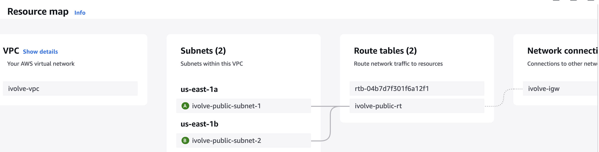
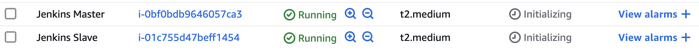
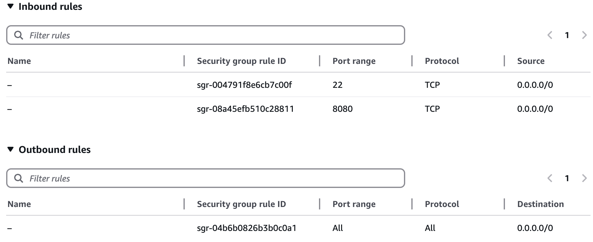
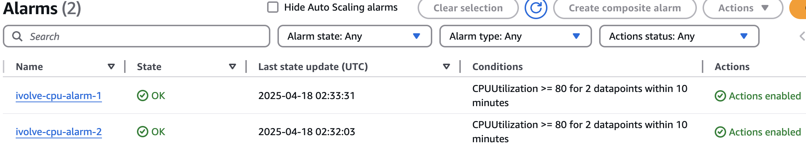
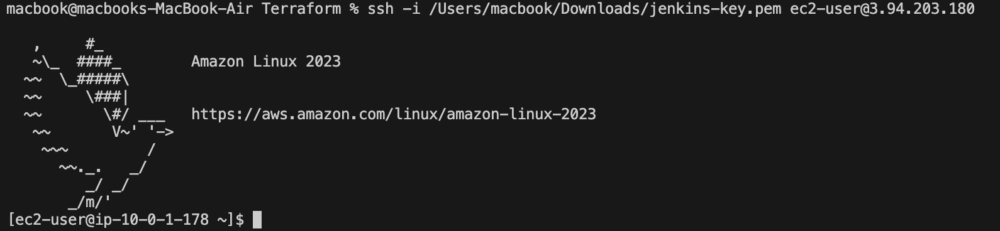

# Jenkins Infrastructure Deployment

## Overview
This document details the exact steps taken to deploy a Jenkins infrastructure on AWS using Terraform. The setup involves provisioning a VPC, configuring subnets, launching EC2 instances for Jenkins Master and Slave, setting up security groups, integrating CloudWatch monitoring, and configuring the Jenkins Master-Slave setup using Terraform modules.

## What I Created
- **Infrastructure as Code (IaC)** using Terraform to automate AWS resource provisioning.
- **AWS VPC and Networking**: A custom VPC with a public subnet and internet gateway.
- **Security Groups**: Defined rules for SSH and Jenkins access.
- **Jenkins Master & Slave EC2 Instances**: Launched instances and configured them for CI/CD.
- **CloudWatch Monitoring**: Set up alarms to monitor CPU utilization.
- **Remote State Management**: Used an S3 backend for Terraform state storage.
- **Terraform Modules**: Used modular architecture for better organization and reusability.

## Project Structure
```
jenkins-infrastructure/
├── main.tf
├── variables.tf
├── outputs.tf
├── modules/
│   ├── network/
│   │   ├── main.tf
│   │   ├── variables.tf
│   │   └── outputs.tf
│   └── servers/
│       ├── main.tf
│       ├── variables.tf
│       └── outputs.tf
└── backend.tf
```

## Steps I Took

### 1. Created Terraform Modules
- **Network Module:** Provisions the VPC, subnet, and security group.
- **Servers Module:** Launches Jenkins Master and Slave instances.

### 2. Configured Terraform Backend (S3)
To store Terraform state remotely and enable team collaboration:
```bash
aws s3api create-bucket --bucket jenkins123-terraform-state --region us-east-1
aws s3api put-bucket-versioning --bucket jenkins123-terraform-state --versioning-configuration Status=Enabled
```

### 3. Created an EC2 Key Pair
To securely access Jenkins instances:
```bash
aws ec2 create-key-pair --key-name jenkins-key --query 'KeyMaterial' --output text > jenkins-key.pem
chmod 400 jenkins-key.pem
```

### 4. Deployed Infrastructure Using Terraform
```bash
terraform init
terraform plan
terraform apply -auto-approve
```

### 5. Verified AWS Resources
Checked the AWS Console to confirm:
- VPC and subnet were created.



- EC2 instances were running.



- Security groups were correctly applied.



- CloudWatch alarms were set up.



### 6. Tested SSH Access to Instances
Retrieved public IPs:
```bash
terraform output
```
Connected to instances:
```bash
ssh -i jenkins-key.pem ec2-user@<jenkins_master_public_ip>
ssh -i jenkins-key.pem ec2-user@<jenkins_slave_public_ip>
```


## Terraform Module Breakdown
### **Network Module (`modules/network/`):**
- Creates VPC, subnet, internet gateway, and security group.
- Exposes Jenkins on ports 22 (SSH) and 8080 (Web UI).
- Outputs subnet and security group IDs.

### **Servers Module (`modules/servers/`):**
- Deploys EC2 instances for Jenkins Master and Slave.
- Attaches security groups and key pairs.
- Enables CloudWatch monitoring for instances.
- Outputs public IPs of Jenkins instances.

